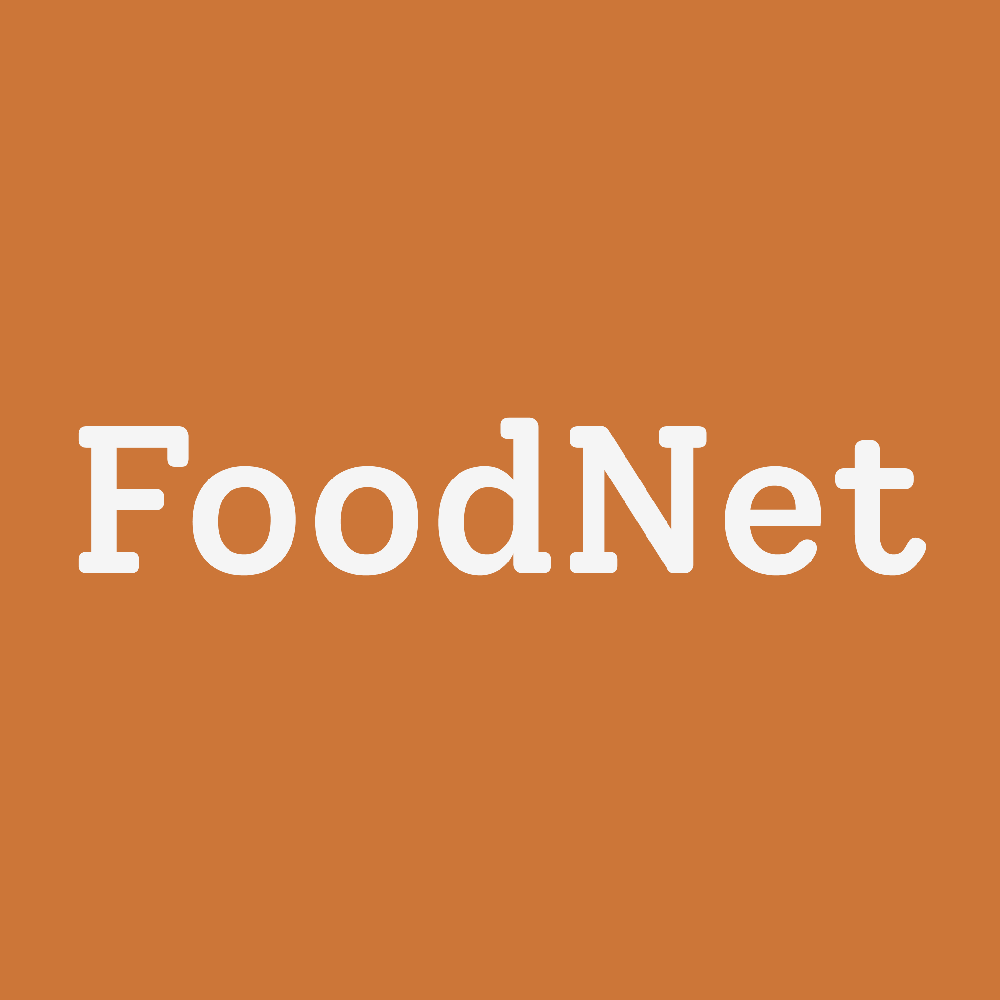
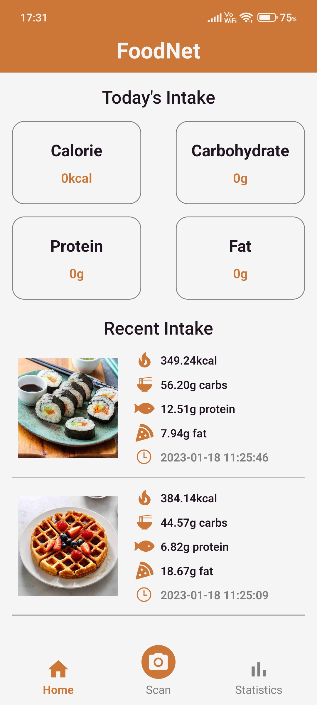

<a name="readme-top"></a>

<!-- PROJECT LOGO -->
<br />
<div align="center">
  <a href="https://github.com/Cheng-K/FoodNet-App">
    
  </a>

<h3 align="center">FoodNet-App</h3>

  <p align="center">
    An automated dietary tracking application by leveraging the deep learning model from the <a href="https://github.com/Cheng-K/FoodNet">FoodNet Project</a>
    <br />
    <br />
    <a href="#demo-video">View Demo</a>
    ·
    <a href="https://github.com/Cheng-K/FoodNet-App/issues">Report Bug</a>
    ·
    <a href="https://github.com/Cheng-K/FoodNet-App/issues">Request Feature</a>
  </p>
</div>

<!-- TABLE OF CONTENTS -->
<details>
  <summary>Table of Contents</summary>
  <ol>
    <li>
      <a href="#about-the-project">About The Project</a>
      <ul>
        <li><a href="#built-with">Built With</a></li>
      </ul>
    </li>
    <li>
      <a href="#getting-started">Getting Started</a>
      <ul>
        <li><a href="#prerequisites">Prerequisites</a></li>
        <li><a href="#installation">Installation</a></li>
      </ul>
    </li>
    <li><a href="#usage">Usage</a>
    <ul>
        <li><a href="#demo-video">Demo Video</a></li>
        <li><a href="#additional-project-information">Additional Project Information</a></li>
        <li><a href="#changing-the-default-built-in-model">Changing the default built-in model</a></li>
    </ul>
    </li>
    <li><a href="#license">License</a></li>
    <li><a href="#contact">Contact</a></li>
  </ol>
</details>

<!-- ABOUT THE PROJECT -->

## About The Project

<div align="center">

</div>
<br/>
This is my final year project for my undergraduate course. FoodNet is a mobile application that uses deep learning to predict the food category, food ingredients, calorie, carbs, protein, and fat from food images.

This project is made up of two repositories : this & [FoodNet](https://github.com/Cheng-K/FoodNet). This repository showcase the development of the FoodNet mobile application proposed in the project.

<p align="right">(<a href="#readme-top">back to top</a>)</p>

### Built With

- [![Tensorflow.js][tensorflow.js]][tensorflow.js-url]
- [![React Native][react-native]][react-native-url]
- [![Expo][expo]][expo-url]
- [![NodeJS][node.js]][node.js-url]
- [![SQLite][sqlite]][sqlite-url]

<p align="right">(<a href="#readme-top">back to top</a>)</p>

<!-- GETTING STARTED -->

## Getting Started

This project should be treated as an expo managed project. To get a local copy up and running follow these simple example steps.

### Prerequisites

- NodeJS >= 16
- npm

### Installation

1. Clone the repo
   ```sh
   git clone https://github.com/Cheng-K/FoodNet-App.git
   ```
2. Install NPM packages
   ```sh
   npm install
   ```
3. Run Expo Prebuild
   ```sh
   npx expo prebuild
   ```
4. Build native directories onto your platform without Expo EAS

   ```sh
   npx expo run:android
   ```

   ```sh
   npx expo run:ios
   ```

   **or**

   Build native directories onto your platform with Expo EAS Build

   _Pre-requisite : This assumes you have a working expo account. If not, refer [here](https://docs.expo.dev/build/setup/#prerequisites) to get started_

   ```sh
   eas build --profile development --platform android
   ```

   ```sh
   eas build --profile development --platform ios
   ```

   This step should prompt you to install a development client into your device.

   _If you encounter any issues, [here](https://www.youtube.com/watch?v=id0Im72UN6w) is a video guide by expo for using EAS Build_

5. Start the development server
   ```sh
   npm start
   ```
6. Open the development client app and connect to the development server via QR code or explicitly typing out the url.

You have successfully set up the local development environment 🎉

<p align="right">(<a href="#readme-top">back to top</a>)</p>

<!-- USAGE EXAMPLES -->

## Usage

To directly preview this application, you may download and install a portable apk file [here](https://expo.dev/accounts/cheng-k/projects/FoodNet-App/builds/7b51a16e-cdce-4933-ac2c-a6a9aa62c86e). **Applicable for android only.**

### Demo Video
<div align="center">
<video src="https://user-images.githubusercontent.com/62346045/224031827-f1a95b2b-f09a-4ca2-9572-30467808ee38.mp4"/>
</div>

### Additional Project Information

The following information may help you to understand the project structure better

```
    |- app (contains all the source code)
        |- assets (static assets bundled in the application)
        |- components (react functional components)
        |- config (configuration for colors and storage paths)
        |- contexts (react contexts)
        |- hooks (react hooks)
        |- screens (source code to build each of the screens)
        |- utils (functions for parsing data for charts, sql statements for sqlite, parsing datetime)
    |- App.js (root-level source code / entry point of application)
    |- remaining are mostly configuration files generated by Expo
```

### Changing the default built-in model

The deep learning model is developed by myself and the code is published in the [FoodNet](https://github.com/Cheng-K/FoodNet) repository. Check out the repository if you would like to know more about the model used.

#### Prerequisite

- Model compatible with Tensorflow.js

  Check out this [guide](https://www.tensorflow.org/js/guide/conversion) to convert an existing tensorflow model to tensorflow.js model

- Cloud to host your model. E.g. The built-in model is hosted at this [repository's release](https://github.com/Cheng-K/FoodNet-Model/releases/latest)

#### Steps

1.  Modify the URLs in the [storage.js](https://github.com/Cheng-K/FoodNet-App/blob/master/app/config/storage.js).

    **IMPORTANT : This assumes your model have the same interface with the [built-in model](https://github.com/Cheng-K/FoodNet-Model), else please modify the model details in [AppStateProvider.js](https://github.com/Cheng-K/FoodNet-App/blob/master/app/contexts/AppStateProvider.js) and [useMountedModel.js](https://github.com/Cheng-K/FoodNet-App/blob/master/app/hooks/useMountedModel.js)**

<p align="right">(<a href="#readme-top">back to top</a>)</p>

<!-- LICENSE -->

## License

Distributed under the MIT License. See `LICENSE.txt` for more information.

<p align="right">(<a href="#readme-top">back to top</a>)</p>

<!-- CONTACT -->

## Contact

Cheng Kei Ong - chengkei.ong@outlook.com - [![LinkedIn][linkedin-shield]][linkedin-url]

Project Link: [https://github.com/Cheng-K/FoodNet-App](https://github.com/Cheng-K/FoodNet-App)

<p align="right">(<a href="#readme-top">back to top</a>)</p>

<!-- MARKDOWN LINKS & IMAGES -->
<!-- https://www.markdownguide.org/basic-syntax/#reference-style-links -->

[linkedin-shield]: https://img.shields.io/badge/linkedin-%230077B5.svg?style=for-the-badge&logo=linkedin&logoColor=white
[linkedin-url]: https://www.linkedin.com/in/chengkei-ong
[expo]: https://img.shields.io/badge/expo-1C1E24?style=for-the-badge&logo=expo&logoColor=#D04A37
[expo-url]: https://expo.dev/
[react-native]: https://img.shields.io/badge/react_native-%2320232a.svg?style=for-the-badge&logo=react&logoColor=%2361DAFB
[react-native-url]: https://reactnative.dev/
[tensorflow.js]: https://img.shields.io/badge/TensorFlowJS-%23FF6F00.svg?style=for-the-badge&logo=TensorFlow&logoColor=white
[tensorflow.js-url]: https://www.tensorflow.org/js
[node.js]: https://img.shields.io/badge/node.js-6DA55F?style=for-the-badge&logo=node.js&logoColor=white
[node.js-url]: https://nodejs.org/en/
[sqlite]: https://img.shields.io/badge/sqlite-%2307405e.svg?style=for-the-badge&logo=sqlite&logoColor=white
[sqlite-url]: https://www.sqlite.org/index.html
